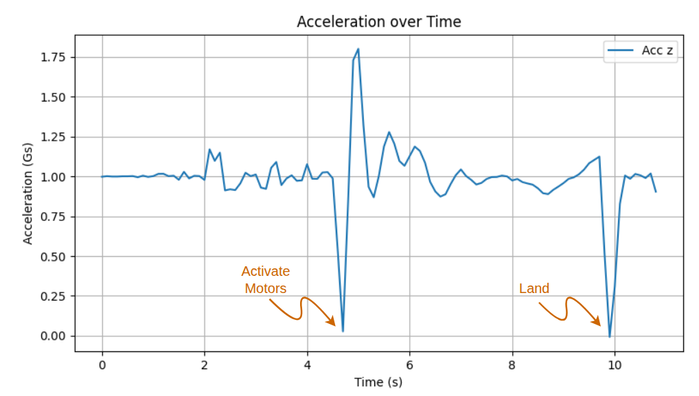

# Drop to take off

The `drop_to_takeoff.py` script aims to enable human-drone interaction,even for simple tasks.

## Hardware requirements
- 1 Crazyflie drone preferably with the thrust upgrade kit
- 1 Lighthouse positioning deck or a Flow deck v2

## How it works
The user holds the Crazyflie and releases it horizontally. It then takes off, stabilizes at the release position, and lands shortly afterward.

The way this script works, is by constantly logging the acceleration of the Crazyflie on the z-axis.
When the Crazyflie is on the ground or being carried around, the acceleration is approximately 1g upwards.
During free fall, acceleration approaches 0, triggering the command to activate the motors and initiate hovering.

