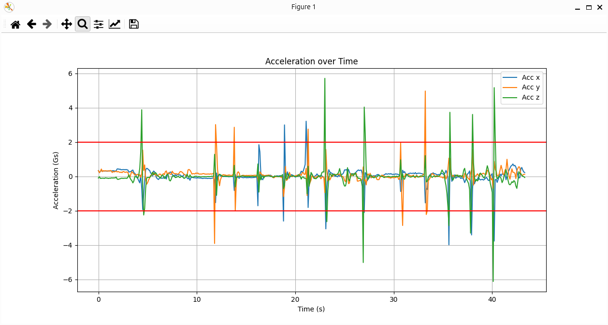
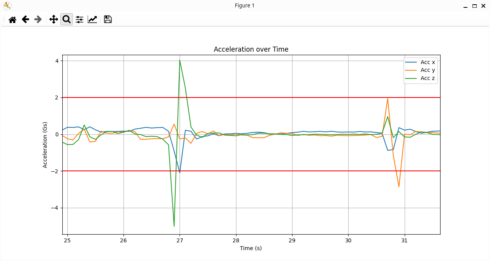

# Fist Flight

The purpose of `fist_flight.py` is to use force (acceleration) data from the user to control a Crazyflie drone.

## Hardware requirements
- 1 Crazyflie drone
- 1 Crazyflie drone with its propellers removed
- 1 Lighthouse positioning deck or a Flow deck v2

## How it works
The user holds or mounts the non-flying Crazyflie on their hand.
By performing fast movements (such as punches) along the three axes, the user can control the flying Crazyflie.
We use the buzzer deck to notify them when the system is ready for an input.

To achieve this, we continuously read the acceleration values from the accelerometer of the non-flying Crazyflie.
On each loop, we check whether the acceleration with the greatest magnitude exceeds the defined threshold.
If it does, the flying Crazyflie moves in the direction of that acceleration.
Keep in mind that since we only read the accelerometer values, the local coordinate frame of the non-flying Crazyflie must be aligned with that of the flying one.

As expected, while moving the non-flying Crazyflie to one direction and aggressively stopping it, we get two opposite acceleration peaks.
This means that if the first acceleration peak doesn't exceed the threshold, but the second (opposite) peak does, the Crazyflie might move in the opposite direction of the intended one.
This case is illustrated by the acceleration along the y-axis in the second graph.

Acceleration over Time           |  Zoom in
:-------------------------:|:-------------------------:
  |  

The script is terminated when the user commands the Crazyflie to go down, while it's already close to the ground.

