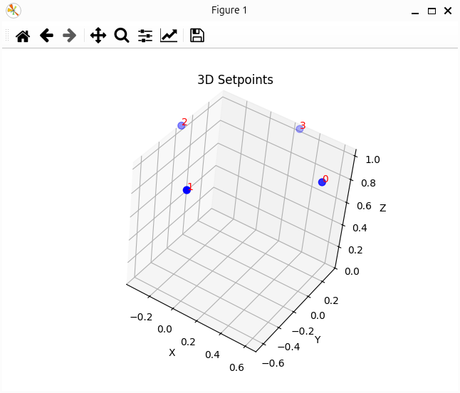

# Flight Path

`flight_path.py` is an example of a drone flying a trajectory defined in setpoints by the user.

## Hardware requirements
- Lighthouse positioning system
- 2 Crazyflie drones
- 2 Lighthouse positioning decks
- 1 Buzzer deck
- 1 Wireless mouse or a good friend willing to stay on the laptop

## How it works
The user defines the trajectory of the Crazyflie by placing position setpoints in space.
The setpoints correspond to the position of the sensor the moment the left button of the mouse is pressed.
Every time a new setpoint is added, you get a sound effect.
Notice that the timestamp of each setpoint is also collected, meaning that the faster you click, the faster the Crazyflie will fly.
When you are satisfied by the number of setpoints, press the right button and check the generated figure.
If the setpoints seem right, close the figure and let the Crazyflie perform its trajectory.

Keep in mind that the first click only "wakes up" the Crazyflie and doesn't collect any data.
Also, before the Crazyflie starts performing its trajectory, it will takeoff and hover over its initial position.
Finaly, there is the option to enable yaw data to be recorded by setting `ENABLE_YAW = True`.
However, this doesn't work as expected for now.

When the trajectory is completed, the script is terminated
