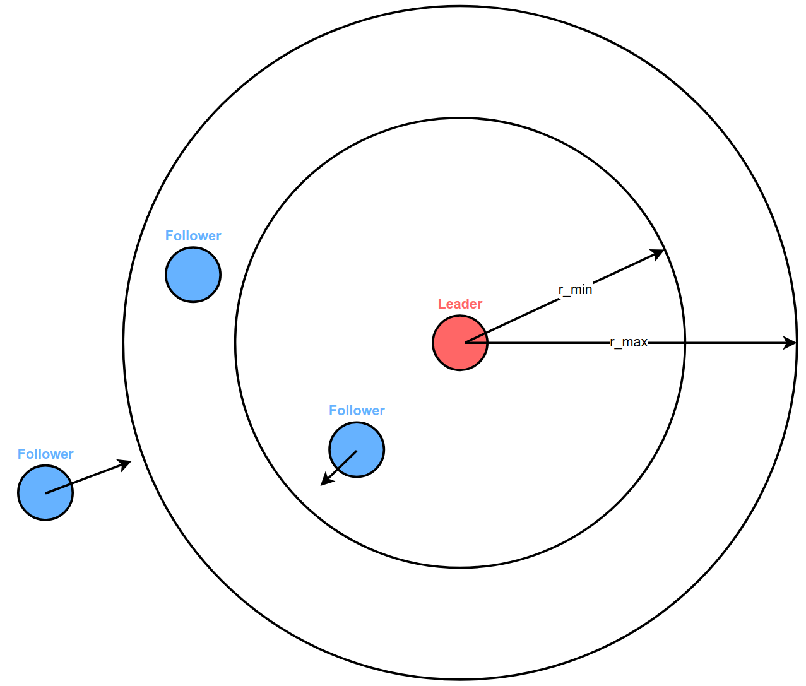
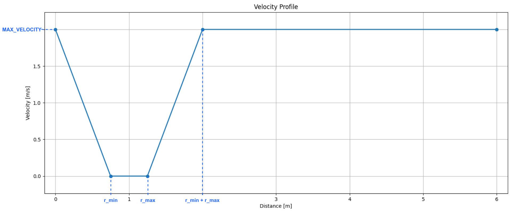

# Leader-Follower (Human-Drone)

The `Leader-Follower_Human-Drone.py` is an example of a swarm sharing data and performing a leader-follower scenario using the motion commander.
The script is based on human interaction with the drones, as the trajectory of the leader is defined by the user moving it around.
It aims at documenting how to use the collected data to define new trajectories in real-time.

## Hardware requirements
- Lighthouse positioning system
- 2 Crazyflie drones
- 2 Lighthouse positioning decks

## How it works
The follower takes off and turns until the its local coordinate system is aligned with the global one.
Then, the user can start moving the leader around.
The follower is constantly commanded to keep a defined distance from the leader on the horizontal plane, meaning that it is moving towards the leader when their current distance is larger than the defined one and away from the leader in the opposite scenario.

The velocity of the follower is not constant; instead, it follows a user-defined profile. To avoid collisions, this velocity profile should follow the pattern illustrated below. It can be modified by changing the parameters `MAX_VELOCITY`, `r_min` and `r_max`.

The script is terminated when the leader is placed close to the ground.

