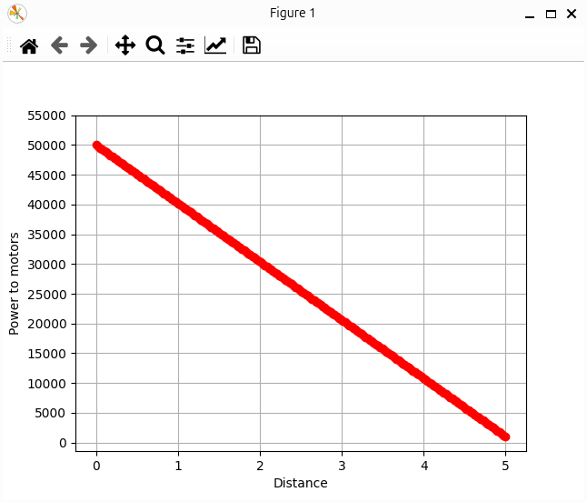
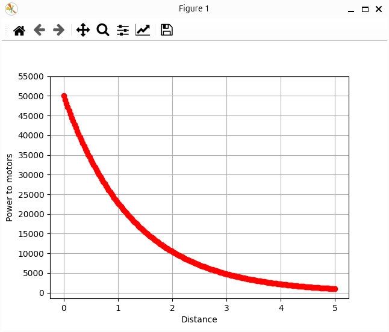

# Vibration

The `vibration.py` script aims to enable haptics as a means of communication between humans and robots.

## Hardware requirements
- 1 Crazyflie drone with its propellers removed
- 1 Lighthouse positioning deck

## How it works
The user holds the Crazyflie and attempts to get as close as possible to a randomly selected point in space. As they approach the point, the drone's vibrations become stronger.

The user can also choose the profile of the power sent to the motors, with respect to the distance between the drone and the target point. This can be done through the `LINEAR_CURVE` and `EXPONENTIAL_CURVE` flags. For now, they can choose between a linear or an exponential curve.

Linear curve            |  Exponential curve
:-------------------------:|:-------------------------:
  |  