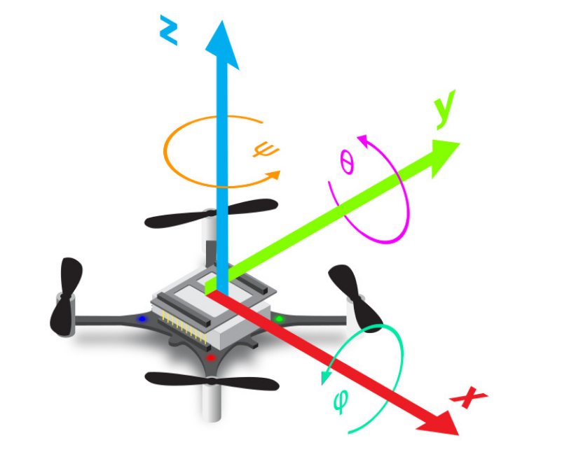
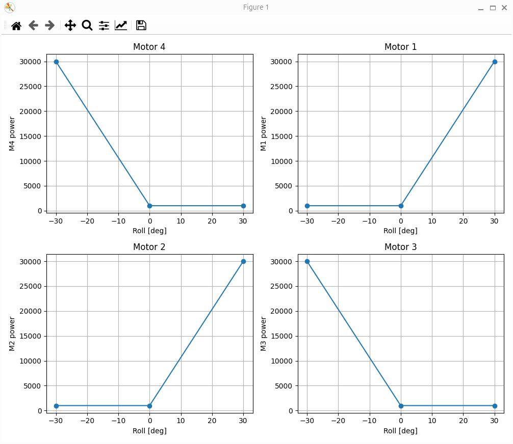
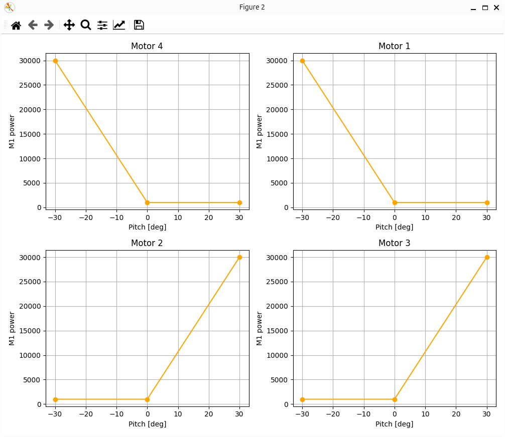

# Hover Simulation

The purpose of `hover_simulation.py` is to demonstrate the hovering behavior of a quadcopter using data from its IMU sensors and specifically from its gyro.

## Hardware requirements
- 1 Crazyflie drone with its propellers removed

## How it works
The user holds the Crazyflie at a horizontal state, just as it was flying. By tilting it around the x and y axes, different motors are activated to counter that state and steer it again towards the horizontal one.

To achieve that, we constantly read the roll and pitch values of the gyro. Depending on these values, we calculate the necessary power for each motor. The profiles of each motor's power with respect to roll and pitch angles is shown in the following graphs.

Roll Profile           |  Pitch Profile
:-------------------------:|:-------------------------:
  |  

The user can modify these profiles by changing the `min_angle`, `max_angle`, `min_power`, `max_power` parameters. Keep in mind that the maximum power could be reached both by a roll and by a pitch angle value. However, the command sent to the corresponding motor will not exceed the `max_power` threshold.

The script is terminated when the Crazyflie is turned upside down.