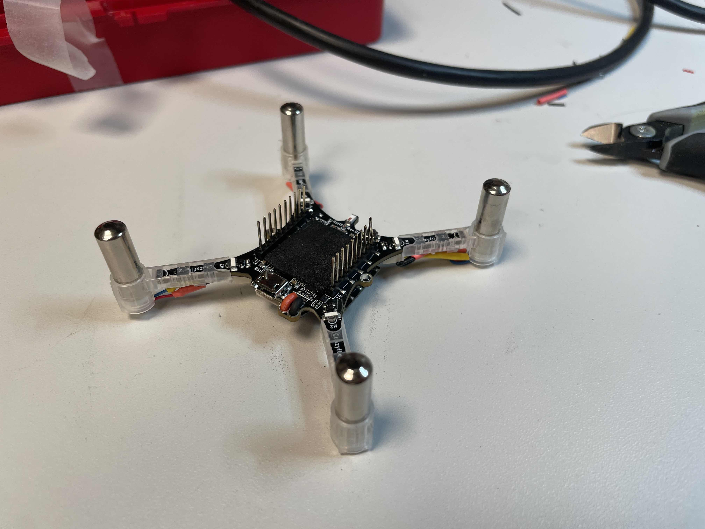

# Angular Velocity-Based Vibration Control

The purpose of `vibe_to_ang_vel_swarm.py` is to control the vibration intensity of multiple Crazyflie drones based on their angular velocity. This script uses data from the drones to calculate angular velocity and adjust motor power accordingly.

## Hardware Requirements
- At least 1 Crazyflie drone, no decks required.  We reccomend replacing the motors with vibration motors or at least replacing the propellers with a small counter weight for each shaft. 

## How It Works
The script connects to multiple Crazyflie drones and logs their quaternion data in real-time. Using this data, it calculates the angular velocity of each drone and adjusts the motor power to simulate vibration intensity. The vibration intensity is proportional to the angular velocity, creating a feedback loop based on rotational speed.

### Adjustable Parameters
- `max_power`: Works up to 60000
- `max_angular_velocity_dps`: Angular velocity that produces maximum power (default: 400°/s).
- `samples`: Number of samples taken then averaged for smoothing (default: 4).
- `invert`: If `True`, higher angular velocity results in lower motor power.
- `vibration_exponent` parameter controls the shape of the response curve for converting angular velocity to motor power:
- **Exponent Below 1**: Produces a concave curve, making the system more sensitive to small angular velocity changes. Motor power increases rapidly at lower angular velocities but slows down as angular velocity approaches the maximum.
- **Exponent Above 1**: Produces a convex curve, making the system less sensitive to small angular velocity changes. Motor power increases slowly at lower angular velocities but accelerates as angular velocity approaches the maximum.
- **Exponent Equal to 1**: Produces a linear response, where motor power increases proportionally with angular velocity.

### Bandwidth
The log_period might need to be lengthened if you add so many crazyflies that you exceed the bandwidth of the radio. The log_period will also affect the responsiveness of the vibration. 

### Termination
The script can be terminated by pressing `Ctrl+C`. All motors are automatically turned off when the script exits.

## Visualization
Future updates will include plots to visualize the vibration function and angular velocity data for better understanding and tuning.